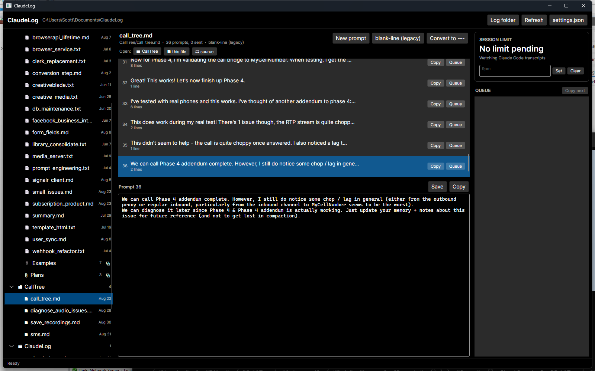

# ClaudeLog

A markdown prompt editor for Claude Code on Windows. Write a prompt like you'd write anything else
worth thinking about first, send it with one click into a real Claude Code session, and keep a log
of everything you've sent — organized by project, readable as plain markdown even with the app
closed.

If you've ever drafted a prompt in a text editor because a terminal isn't where you want to
compose, then copy-pasted it over — this is that workflow with the copy-paste taken out. Same
folders, same files you already have; ClaudeLog just makes sending, tracking and resuming them
effortless.



## What it does

- **Projects and sessions** in a tree — one folder per project, one file per session, exactly the
  layout that's already there. `.md` and `.txt` both count. Sessions are listed newest-edited
  first, so whatever you were working on is at the top.
- **Prompts as units.** A session file is split into its prompts, each with a one-click **Send**
  that puts it straight into that session's Claude Code, marks it sent and timestamps it. No more
  selecting to the next blank line by hand. **Copy** is still there for prompts going somewhere
  else.
- **A Claude Code session per log file.** Each session file remembers the conversation it belongs
  to and the directory that conversation runs in, so reopening a file three weeks later and
  pressing **Send** resumes the same conversation rather than starting a new one.
- **The whole file, visible.** Each prompt is shown in full and highlighted, so the list reads like
  the session file itself rather than an index of it — and the prompt you're editing updates there
  as you type.
- **A queue for when the session limit hits.** Queue the prompts you couldn't send; ClaudeLog
  reads the reset time out of Claude Code's own transcripts, counts down, and when the limit
  resets it toasts you, flashes the taskbar and puts the next queued prompt on the clipboard.
  It doesn't send it for you unless you ask (`AutoSendOnReset`) — the reset usually lands while
  you're away from the machine. If detection ever comes up empty, right-click the countdown for
  **Set the reset time manually**.
- **Explorer shortcuts** for the project folder and its attachment folders (`Examples`, `Plans`),
  from the tree or the session header.
- **File management in the tree.** Right-click a project to add a session, a session to rename it or
  change how it's split. A new name without an extension gets `.md`.

## Writing

The editor is built for getting a prompt down fast and reading it back.

- **Markdown highlighting** — fenced and inline code, bullets, numbered steps, headings, bold,
  quotes. Enough to see the shape of a prompt at a glance, and nothing else. The same colors in the
  editor and in the list above it.
- **Completion from your own logs.** Every word across every session is indexed, so `SIPSorc…`
  completes to `SIPSorcery` in a file that has never mentioned it. Type three letters, or press
  `Ctrl+Space`. Words from the prompt you're writing rank above words from June.
- **Spell checking** through Windows' own spell checker, filtered hard so it stays quiet: nothing
  inside fences, inline code, URLs or paths; nothing that looks like an identifier
  (`AIMediaSession`, `resetsAt`, `SIP`); and nothing you've used more than a couple of times
  anywhere in your logs. Right-click a squiggled word — or press `Ctrl+Space` in it — for
  corrections and *Add to dictionary*, which adds to the Windows user dictionary the rest of the
  OS reads. The right-click menu carries cut/copy/paste/select-all below that, wherever you click.

Run `ClaudeLog --spell <file>` to see exactly what would be flagged in a file, and why the filter
matters — on a 540-line session it's about a dozen words, most of them real typos.

## Sending

Each session file gets its own Claude Code conversation. The button in the session header starts
it — `○ No terminal` becomes `● Source · ca62d7e8` — and from then on **Send** (or `Ctrl+Enter`)
puts the selected prompt into it.

- **It doesn't take focus and doesn't touch the clipboard.** The prompt is written into the
  terminal's console directly, addressed by process, so it works with the window behind others or
  minimised, and it can't land in the wrong window because you clicked somewhere mid-send.
- **Multi-line prompts arrive as one prompt**, the same as a paste — newlines don't submit early.
- **It checks that the prompt arrived.** After sending, ClaudeLog looks in Claude Code's own
  transcript for the session and says either *"Claude Code has it"* or *"not confirmed in the
  transcript — check the terminal"*. Writing to a console always succeeds if the console exists;
  the transcript is the only thing that proves the prompt was taken as a prompt rather than
  answering a permission dialog.
- **The conversation outlives the terminal.** ClaudeLog picks the session GUID and passes it to
  `claude --session-id`, then reuses it with `claude --resume`. Close the terminal, close the app,
  come back next week — the same conversation reopens. **Clear Claude session** on the button's
  right-click menu starts a fresh one next time.
- **A conversation ClaudeLog didn't start can be adopted.** Sessions from before the app have
  transcripts under `%USERPROFILE%\.claude\projects\<slugged-directory>\<id>.jsonl`;
  **Set session id…** on the same menu takes that id and attaches it to the open file, so the next
  start resumes it. It says whether the transcript for that id and directory actually exists.

### Where a session runs

Claude Code needs a working directory, and the useful one is usually not the project folder but a
root above it that has a `CLAUDE.md` covering everything:

```jsonc
"DefaultSessionDir": "D:\\Source",          // every project runs here
"ProjectSessionDirs": { "CallTree": "D:\\Source\\repos\\CallTree" }  // except this one
```

With neither set, a project's session runs in its `ProjectSources` folder. A single file can be
pointed somewhere else with **Session directory…** on the terminal button's right-click menu; that
choice sticks to the file, so changing a project's default later doesn't strand it.

The terminal itself is a setting. Windows Terminal by default, but nothing depends on it —
delivery goes through the Win32 console, which any terminal that hosts a real console provides:

```jsonc
"TerminalExe": "wt.exe",
"TerminalArgs": "-w {0} new-tab --title {1} -d {2} powershell.exe -NoProfile -ExecutionPolicy Bypass -File {3}"
```

`{0}` window name, `{1}` tab title, `{2}` working directory, `{3}` the script that reports its PID
and runs Claude Code.

**The shell inside that tab is PowerShell or Git Bash**, per project:

```jsonc
"DefaultShell": "GitBash",                          // every project uses Git Bash
"ProjectShells": { "CallTree": "PowerShell" }        // except this one
```

Git Bash uses `TerminalArgsGitBash` instead of `TerminalArgs` (same four placeholders), and gets a
`.sh` launch script instead of a `.ps1` one. Everything downstream — the PID file, sending prompts
into the console — works the same either way.

## Prompt separators

Two ways a file can be split, per file:

- **`---` separators** (default for new files) — a `---` line ends a prompt. Unambiguous when a
  prompt spans paragraphs or contains fenced code.
- **Blank-line (legacy)** — what the existing files use. A blank line ends a prompt, except where
  the text says otherwise: lists, fences, headings, tables and anything introduced by a line
  ending in a colon stay with the prompt above them, and a prompt containing markdown headings
  ends only at a double blank line.

A file that already contains `---` opens in `---` mode automatically. Both are on the file's
right-click menu in the tree, along with **Convert file to `---` separators**, which rewrites a
legacy file with explicit separators once its boundaries look right.

## Keys

| | |
|---|---|
| `Ctrl+S` | save the editor into the file |
| `Ctrl+Enter` | send the selected prompt to this session's Claude Code, mark it sent |
| `Ctrl+Shift+Enter` | copy the selected prompt instead, mark it sent |
| `Ctrl+T` | start this session's terminal, or bring it to the front |
| `Ctrl+N` | new prompt (focus jumps to the editor) |
| `Ctrl+Q` | queue the selected prompt |
| `Ctrl+E` | jump into the editor |
| `Esc` | leave the editor for the prompt list |
| `Ctrl+Space` | suggestions at the cursor — completions, or spelling fixes on a squiggled word |
| `F5` | rescan the log folder |

In the suggestion popup: `↑`/`↓` to move, `Enter` or `Tab` to accept, `Esc` to dismiss.

## Command line

```powershell
ClaudeLog                    # the app
ClaudeLog --tree             # projects, sessions, prompt counts
ClaudeLog --parse <file>     # how a file splits into prompts (--legacy / --modern to force)
ClaudeLog --quota            # the detected session-limit reset
ClaudeLog --state            # where settings and state live
ClaudeLog --spell <file>     # words the spell checker would flag in a file
ClaudeLog --terminal         # every file's Claude session: directory, pid, transcript
ClaudeLog --terminal --start <dir>   # open one there, print its session id and pid
ClaudeLog --send <pid> <text>        # write one prompt into that terminal
ClaudeLog --selftest         # parser, save round-trip, spelling and state checks
ClaudeLog --startup          # boot the UI without showing it, then exit
```

## Install

Requires **Windows x64**. The released binary is self-contained — no .NET runtime, no installer, no
dependencies.

Download [**ClaudeLog.exe**](https://github.com/nothotscott/ClaudeLog/releases/latest/download/ClaudeLog.exe)
from the [latest release](https://github.com/nothotscott/ClaudeLog/releases/latest) and run it. It
is not code-signed, so SmartScreen warns the first time; the release page publishes a SHA-256 to
check the download against.

On first run it writes `%LOCALAPPDATA%\ClaudeLog\settings.json` and looks for logs in
`Documents\ClaudeLog`. Point `LogRoot` at wherever yours live — one folder per project, one markdown
file per session — and press `F5`.

## Build

```powershell
dotnet build
dotnet run
```

.NET 10, Avalonia 12, AvaloniaEdit. Windows only — Explorer integration, the taskbar flash and the
spell checker are all Win32/COM.

Every push builds the release binary and runs it (`--startup`, `--selftest`, `--parse`). Pushing a
`v*` tag publishes that same binary as a GitHub release:

```powershell
git tag v0.1.0
git push origin v0.1.0
```

## Settings

**Settings** in the header opens a dialog over the settings worth a control: the log root and
default session directory, the separator new files get, the shell and executables a terminal is
launched with, the delay before the submitting Enter, and what happens when the limit resets. Its
dropdown still opens `settings.json` itself, along with the app-data folder and `claudelog.log` —
the per-project maps (`ProjectSources`, `ProjectSessionDirs`, `ProjectShells`) and the terminal
command-line templates are edited there.

## Where things are

- Logs: `C:\Users\Scott\Documents\ClaudeLog` — never modified except the session files themselves.
- Settings, per-prompt state, backups and `claudelog.log`: `%LOCALAPPDATA%\ClaudeLog\` —
  deliberately outside the Syncthing-synced log folder. Set `CLAUDELOG_HOME` to point elsewhere
  (handy for running a second instance against throwaway state).
